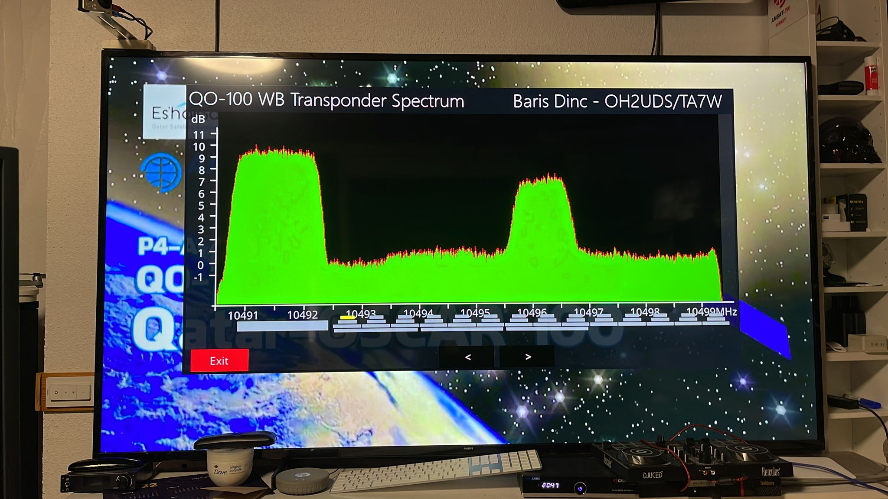

# qo100_wb_transponder_plugin
An openATV plugin for QO-100 Wideband transponder

After installing the plugin to a OpenATV Satellite receiver (e.g. Octagon SF800) you will access to the pplugin via plugins menu.
You will see the tramsnitting stations on the spectrum. Top left one is the QO-100 Beacon.
You can use the arrow keys to select the transmission you would like to tune. The selected transmission (channel) will be highlighted with yellow boc on the bottom of the spectrum displa.
Please see the picture below

  
### Credits
  Burcu Aybak Dinc (OH2CAV/TA2NBA)
